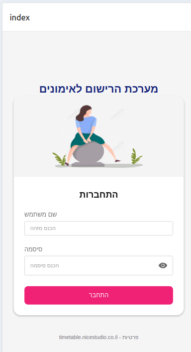
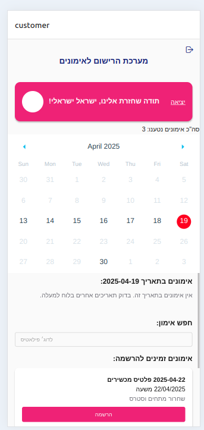
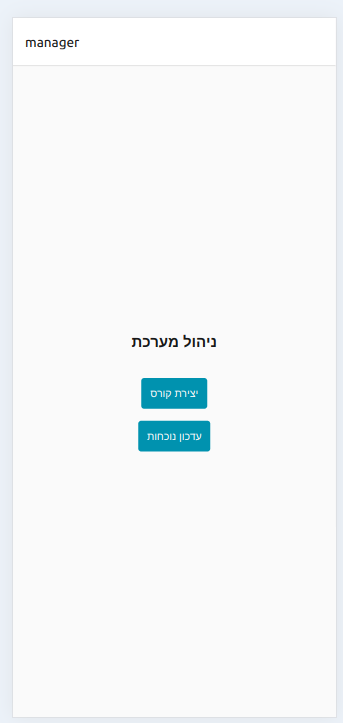
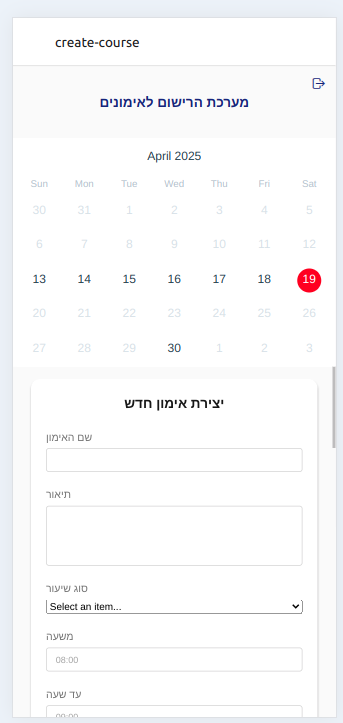
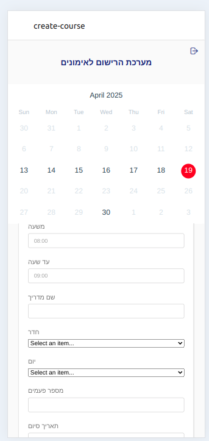
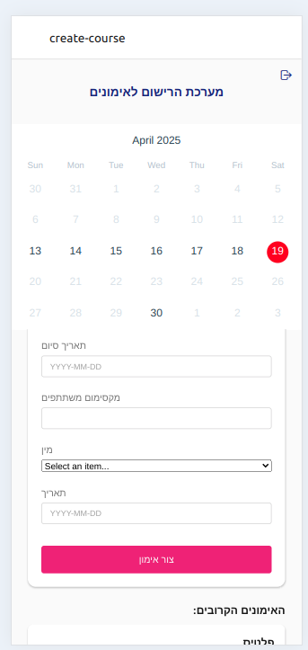
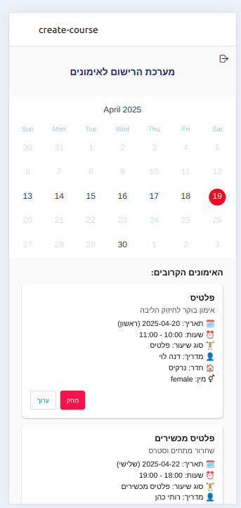
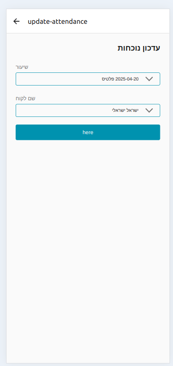

# 🧘‍♀️ Fitness Training Scheduler App

A mobile app built with **React Native + Expo**, allowing **customers** to view and register for sessions and **managers** to schedule and manage training courses.

---

## 📱 Screenshots

### 🔓 Login Screen


### 📅 Customer Home with Weekly Calendar


### 🧑‍💼 Manager Page



### 🧑‍💼 Create  Course Page





### 🧑‍💼 Update Attendance Page


---

## 🚀 Features

- Login with ID and password
- Manager and Customer roles
- Weekly calendar navigation
- Session filtering by date
- Responsive and RTL-friendly UI
- NativeBase + Zustand state management

---

## 🧱 Tech Stack

- React Native + Expo
- NativeBase UI components
- Zustand (global state)
- dayjs (date formatting)
- react-native-calendars (calendar)

---

## 🔧 Installation

```bash
git clone https://github.com/yourusername/fitness-app.git
cd fitness-app
npm install
npx expo start
